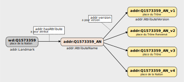

# Peuplement de l'ontologie de l'évolution temporelle
Ce répertoire permet de peupler l'ontologie de l'évolution temporerelle des entités géohistoriques en se restreignant sur la ville de Paris.

Avant de lancer le script présent dans `voies_paris_hist.ipynb`, il faut :
* avoir un envrionnement de Python comportant les librairies suivantes : `urllib`, `rdflib` et `SPARQLWrapper` ;
* avoir installé le logiciel GraphDB afin de pouvoir stocker le graphe qui va être créé. Pour que cela fonctionne, lancez GraphDB et assurez-vous que l'URL corresponde bien à la variable `graphdb_url` de `voies_paris_hist.ipynb`. Si tel n'est pas le cas, modifiez la variable ;

:warning: Le notebook `voies_paris_hist.ipynb` créé un répertoire dans GraphDB dont l'identifiant est donné par `project_id`. Si la valeur de cette dernière est la même qu'un de vos répertoires de GraphDB, changez-la afin d'éviter d'écraser votre répertoire.

En lançant l'intégralité du notebook, les choses suivantes sont faites :
* création d'un répertoire dans GraphDB
* import des voies de Paris avec leur localisation (dans les arrondissements et/ou les quartiers de la ville) et l'ensemble des noms qu'elles ont portés.
* structuration de l'historique des noms d'une voie selon l'ontologie définie dans `events_ont.ttl`. Pour chaque voie `?voie`, on lui associe un attribut `?attributNom` qui va relier l'ensemble des versions des noms qu'a portés la voie.

